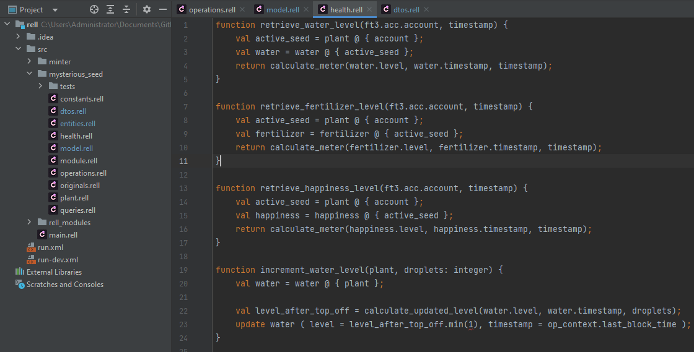

# Rell Jetbrains

<!-- Plugin description -->
Rell programming language plugin. 

Rell is a programming language built for the relational blockchain platform Chromia. 
It allows to you build dapps in a way that's safe, concise and intuitive.
<!-- Plugin description end -->

## Installation

- Using IDE built-in plugin system:
  
  <kbd>Settings/Preferences</kbd> > <kbd>Plugins</kbd> > <kbd>Marketplace</kbd> > <kbd>Search for "rell-jetbrains"</kbd> >
  <kbd>Install Plugin</kbd>
  
- Manually:

  Download the [latest release](https://bitbucket.org/chromawallet/rell-jetbrains/downloads/rell-jetbrains-0.0.1.zip) and install it manually using
  <kbd>Settings/Preferences</kbd> > <kbd>Plugins</kbd> > <kbd>⚙️</kbd> > <kbd>Install plugin from disk...</kbd>

---
Plugin based on the [IntelliJ Platform Plugin Template][template].

[template]: https://github.com/JetBrains/intellij-platform-plugin-template
[docs:plugin-description]: https://plugins.jetbrains.com/docs/intellij/plugin-user-experience.html#plugin-description-and-presentation

## Useful resources
