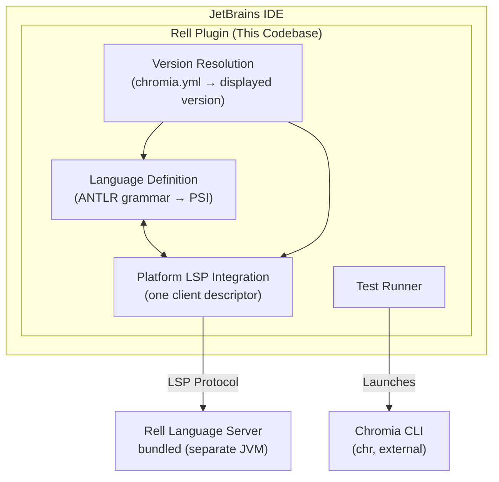
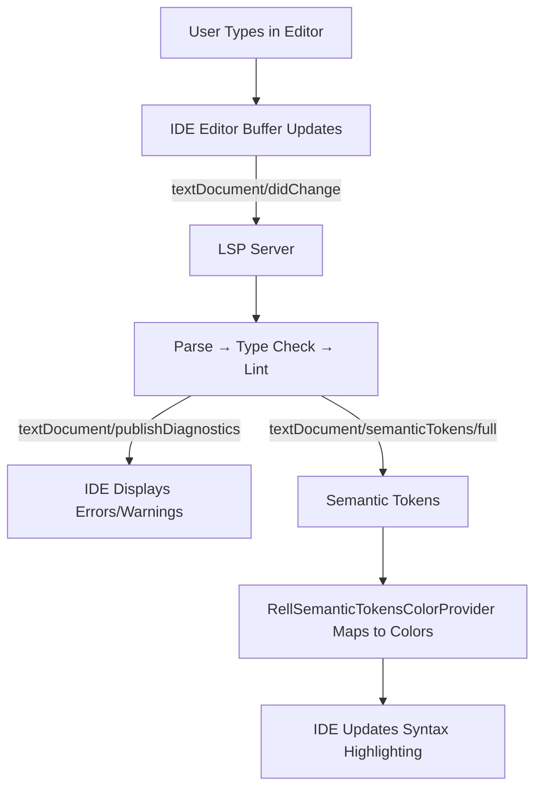

# Architecture

[← Previous: Overview](01-overview.md) | [Next: Getting Started →](03-getting-started.md)

---

## Why This Architecture

### Core Architectural Decision: Language Server Protocol (LSP)

**What:** The plugin delegates nearly all language intelligence (syntax checking, completion, navigation) to a separate Rell Language Server(LSP) process.

**Why:**

1. **Code Reuse:** The same Rell language server can be used across multiple editor integrations (VS Code, Vim, Emacs, etc.). Building language intelligence once and reusing it is more maintainable than reimplementing it per IDE.

2. **Separation of Concerns:** Language semantics (parsing, type checking, analysis) are separate from IDE integration (UI, keybindings, platform APIs). This allows language experts to work on the server and IDE integration experts to work on the plugin.

3. **Performance Isolation:** The LSP server runs in a separate JVM process with dedicated heap (default max 2GB). Heavy language analysis doesn't block the IDE's UI thread or compete for IDE memory.

4. **Independent Updates:** Language features can be updated by releasing new LSP server versions without requiring plugin updates (as long as LSP protocol remains compatible).

### Why a Local ANTLR Parser Despite LSP?

**What:** The plugin builds a local parser from Rell's own ANTLR grammar (`Rell.g4`), consumed via [antlr4-intellij-adaptor](https://github.com/antlr/antlr4-intellij-adaptor), even though the LSP server also performs parsing.

Rell 0.16.0 retired the better-parse combinator parser in favor of ANTLR and removed the BNF-generation helper that previously fed a Grammar-Kit grammar (release note #10). The ANTLR grammar shipped in `rell-base` is now the single source of truth for Rell syntax, so the plugin consumes it directly instead of maintaining a hand-synced `Rell.bnf`.

**Why:**

Even though the LSP server handles compilation, the IDE still needs a local AST (Abstract Syntax Tree) for:

1. **Fallback Highlighting:** Basic syntax highlighting works immediately while waiting for LSP server to start or when LSP is unavailable.

2. **PSI Tree Navigation:** JetBrains IDEs use PSI (Program Structure Interface) trees for local navigation features. Some IDE features expect a PSI tree to exist.

### Why One Bundled Toolchain?

**What:** A single plugin build carries one Rell toolchain. Every `.rell` file goes to the same
language server, which reads the `compile.rellVersion` declared in the governing `chromia.yml` and
analyses that project at the declared version.

**Why:** The compiler's `compatibility` option makes one build behave as an older release — it gates
library members, behavior switches, and the version-restricted language constructs alike. Shipping a
toolchain per supported version bought nothing the option does not already give, and cost a download
on first use plus a version-exact grammar per release.

The full rules — which settings file governs a file, and what its declared version means — are in
[COMPATIBILITY.md](COMPATIBILITY.md).

### Why Test Runner Integration?

**What:** Custom "Rell Test" run configuration that launches Chromia CLI (`chr test`) and displays results in IDE test runner UI.

**Why:**

1. **Developer Workflow:** Running tests from the IDE (with gutter icons and keyboard shortcuts) is standard practice. Forcing developers to switch to terminal interrupts flow.

2. **Result Visualization:** IDE test runners show pass/fail status, execution time, and failure messages in a familiar UI. Terminal output is harder to parse visually.

**Alternative Considered (Not Chosen):** Could have used external terminal integration, but this provides worse UX and no structured result reporting.

---

## Architecture Deep Dive

### Component Diagram

### Lifecycle: Plugin Initialization to User Action

**1. Plugin Loads (IDE Startup)**
- IDE reads `src/main/resources/META-INF/plugin.xml`
- Registers language (`RellLanguage`), file type (`.rell`)
- Registers the LSP integration provider (`platform.lsp.integrationProvider`) that starts the
  bundled language server
- Registers test configuration type
- Registers tool window factory

**2. User Opens Rell File**
- IDE creates PSI file using `RellParserDefinition`
- Local parser generates PSI tree from source
- Basic syntax highlighting applied via `RellSyntaxHighlighter`
- The platform calls `RellLspIntegrationProvider.fileOpened` for the file
- The provider starts the bundled server's client; the server finds the governing `chromia.yml`
  itself and compiles the project at its declared version
- The client's `RellLspClientDescriptor` launches the server as a subprocess, or connects to
  port 5008 in socket mode (`-Drell.lsp.useSocket=true`)
- Initialization options (index caching, inlay hints) sent to server

**3. Language Intelligence (User Types Code)**
- IDE sends `textDocument/didChange` notification to LSP
- LSP analyzes document, publishes diagnostics (errors/warnings)
- IDE displays red squiggles for errors
- Semantic tokens received from LSP
- `RellSemanticTokensColorProvider` maps tokens to IDE colors
- Syntax highlighting updates
- Constructs the project's declared Rell version does not have are reported by the server as
  ordinary diagnostics, the same way it reports any other compile error

**4. User Invokes Action (e.g., Go to Definition)**
- IDE sends `textDocument/definition` request to LSP
- LSP responds with file URI and position
- IDE navigates to target location

**5. User Runs Test**
- Click gutter icon (provided by `RellTestLineMarkerProvider`)
- IDE creates `RellTestRunConfiguration`
- `RellTestRunProfileState.execute()` called
- Builds command: `chr test --modules <module>` (or `--blockchain` / `--tests`), plus `--hide-lib-warnings`
- Launches process through the system shell via `GeneralCommandLine`
- The SM test runner parses the CLI's TeamCity service messages; `RellTestResultsListener` wraps the
  run in a node reflecting the process exit code
- Results displayed in test runner UI

**6. `chromia.yml` Changes**
- `ChromiaConfigChangeListener` sees the VFS event, drops `RellVersionResolver` caches and publishes
  on the config topic
- Highlighting restarts, banners re-evaluate, and the Rell language servers restart so files re-route
  to the right toolchain

**7. Plugin Unload (IDE Shutdown)**
- LSP server processes terminated
- Caches cleared

### Data Flow: How Code Gets Analyzed

> The diagnostics path (`publishDiagnostics`) and the semantic-tokens path run in parallel — both are produced from the same server-side analysis of the changed document.

---

[← Previous: Overview](01-overview.md) | [Next: Getting Started →](03-getting-started.md)
